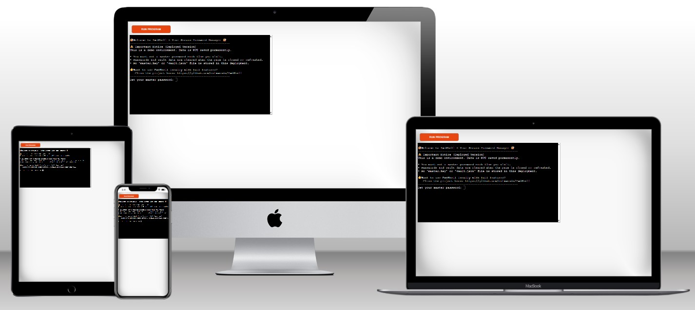
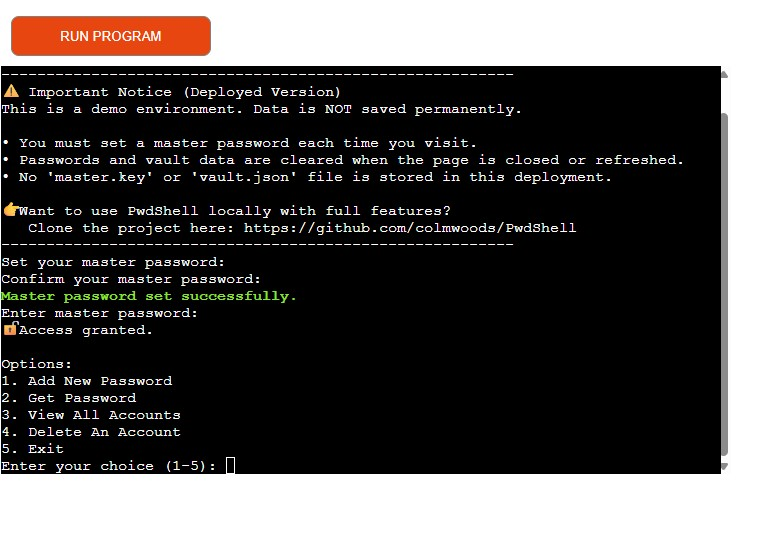
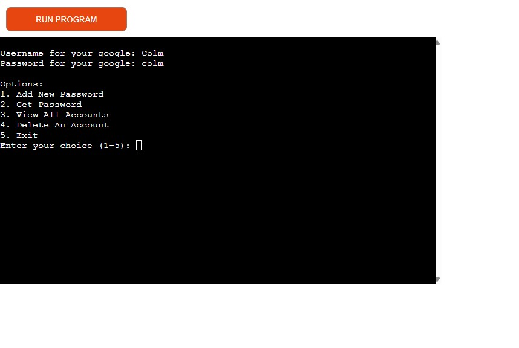
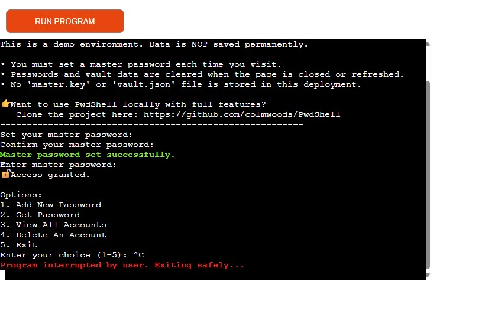
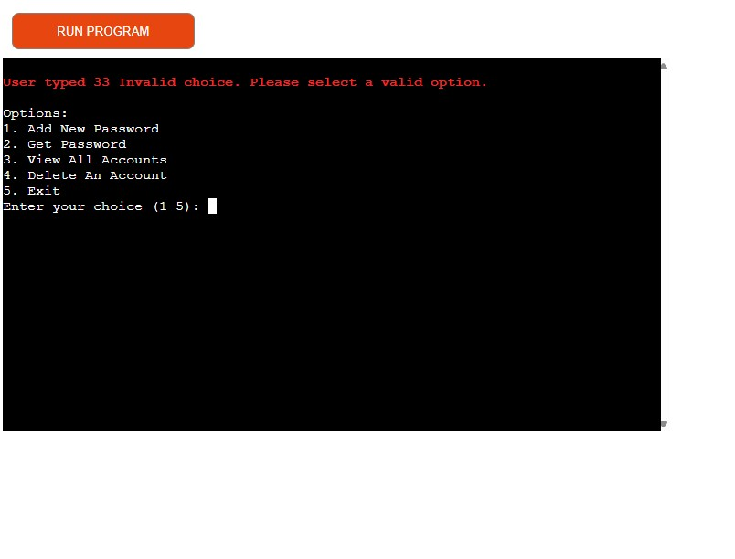
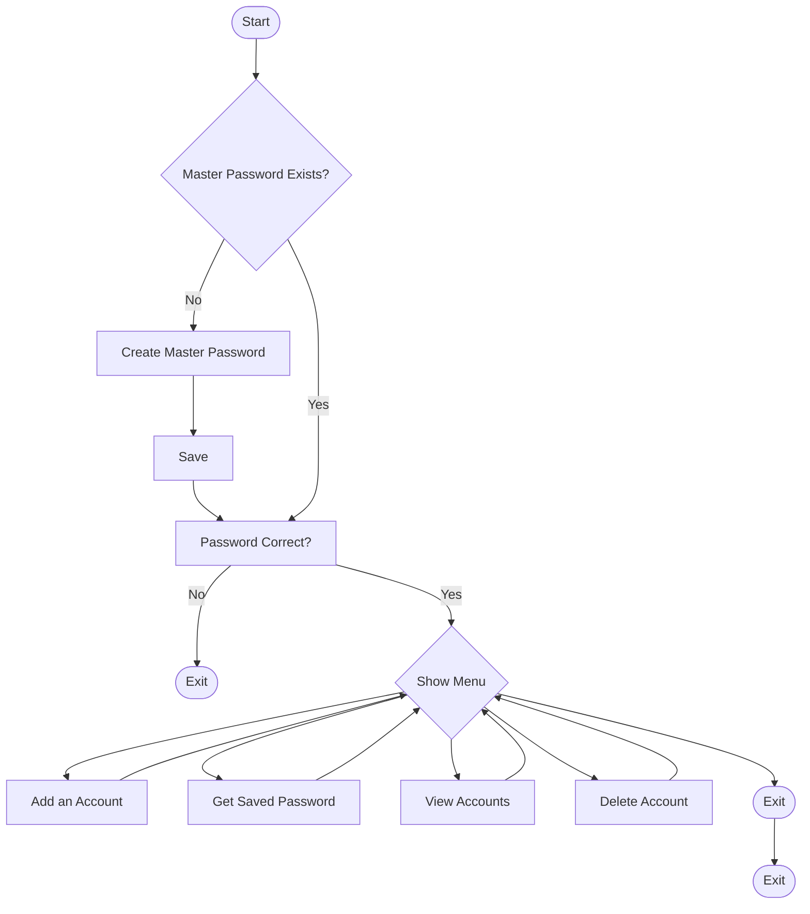
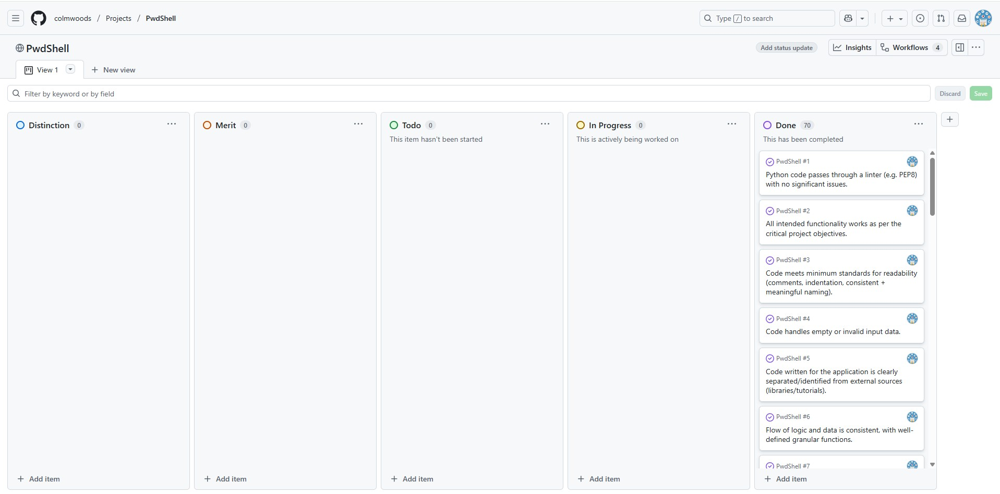
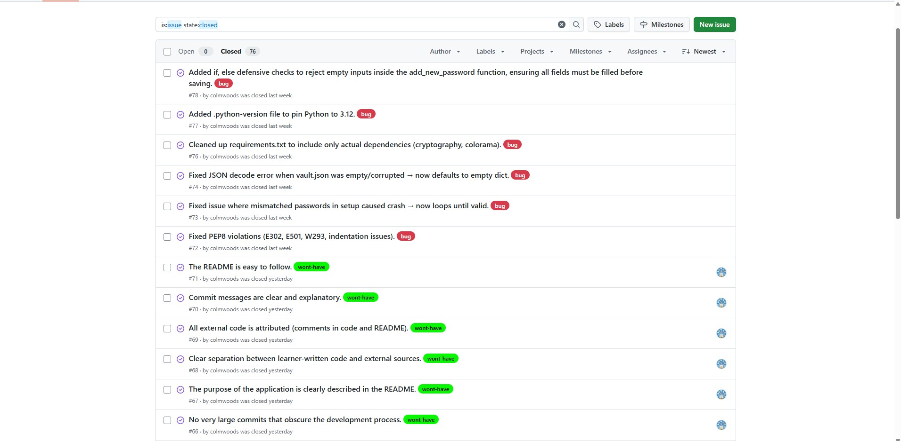

# [PwdShell](https://pwdshell-6bf799458b95.herokuapp.com)

Developer: Colm Woods ([colmwoods](https://www.github.com/colmwoods))

[](https://www.github.com/colmwoods/PwdShell/commits/main)  
[](https://www.github.com/colmwoods/PwdShell/commits/main)  
[](https://www.github.com/colmwoods/PwdShell)  
[](https://pwdshell-6bf799458b95.herokuapp.com)

---
  

Source: [Techsini Multi Device Website Mockup Generator](https://techsini.com/multi-mockup/?url=https://pwdshell-6bf799458b95.herokuapp.com/)  


## Project Introduction and Rationale

PwdShell is a **terminal-based password manager**.  
It allows users to set a **master password** and then store, retrieve, and manage their account credentials securely in a local vault (`vault.json`).

A key design choice was to handle master password storage differently depending on the environment:

You cannot see the master password or the password you set for an account on the screen as I'm using the getpass method which hides the password from being seen.

#### 🔹 Heroku Deployment
- The master password is **session-only**.  
- It resets each time the dyno restarts or the “Run Program” button is pressed.  
- This ensures every user, including Code Institute assessors, can set their own password without needing the developer’s.  
- **No permanent files** (`master.key` or `vault.json`) are written in the deployed version.  

#### 🔹 Local Environment
- The master password is **persisted** in a `master.key` file, hashed with **SHA-256**.  
- Vault data is stored in `vault.json` and is available across runs.  
- This allows users to manage and retain their passwords securely between sessions.  

> Apart from this difference in password persistence, both versions function identically.

I chose this project because password management is a common real-world problem that affects every user.  
It allowed me to explore Python concepts such as hashing, encryption, file handling, and user input validation, while building a tool I could use myself.

---

The project is designed for users who:  
- Want a **lightweight password manager** that doesn’t require browser plugins.  
- Prefer to keep their data **local** instead of relying on third-party services.  
- Need a **simple menu-driven tool** for basic password management.  

I chose this project because:  
- Password management is a **real-world problem** that everyone faces.  
- It gave me a chance to explore **hashing, encryption, JSON storage, and Python file handling**.  
- It’s a project I can personally use to manage my own credentials.  

---

## UX

### The 5 Planes of UX

#### 1. Strategy

**Purpose**
- Provide users with a secure vault for account credentials.  
- Protect access to sensitive data with a master password.  

**Primary User Needs**
- Add new account credentials quickly.  
- Retrieve stored account details.  
- View all accounts in the vault.  
- Delete accounts no longer needed.  

**Business Goals**
- Deliver a simple, functional password manager.  
- Encourage safe password practices by making management easy.  

#### 2. Scope

**Features**
- Master password setup and verification.  
- Add account with username + password.  
- Retrieve account details.  
- View all accounts.  
- Delete accounts.  

#### 3. Structure

**Information Architecture**
- App opens with master password check.  
- Menu-driven interface for all actions.  

**User Flow**
1. User runs app → sets/verifies master password.  
2. Main menu appears.  
3. User chooses to add, view, retrieve, or delete accounts.  
4. Vault updates automatically.  

#### 4. Skeleton

Screenshot of the terminal menu structure that users interact with after logging in, no wireframes only text menu.  
  

#### 5. Surface

**Visual Design Elements**
- Minimal text UI.  
- Symbols and dividers used for readability.  

**Colours**  
- The terminal app primarily uses the system terminal’s default colour scheme.  
- To improve readability, [Colorama](https://pypi.org/project/colorama/) has been implemented:  
  - `SUCCESS` messages appear in **bright green**.  
  - `ERROR` messages appear in **bright red**.  
  - `RESET` restores the terminal back to its default style.  

**Typography**
- The app uses the system’s default **monospaced font** (e.g., Consolas, Courier New, or Menlo depending on OS).  
- This ensures consistent character alignment in the terminal.

---

### Positive User Experience
PwdShell was designed to create a positive emotional response for the user:
- **Clear colour-coded feedback** makes success and errors easy to recognise.  
- **Welcoming language and emojis** provide reassurance and friendliness in what could otherwise be a dry CLI app.  
- **Defensive programming** prevents frustration by handling invalid inputs gracefully.  
- **Trust-building features** like hidden password entry (`getpass`) give users confidence their data is secure.  
- **Consistent menu-driven flow** ensures users always know where they are and what actions are available.  

Together, these elements make the user feel secure, supported, and confident while interacting with the program.

---

## Wireframes

“Instead of GUI wireframes, the terminal menu structure acts as the skeleton design. See screenshot below.”


---

## User Stories

| Target | Expectation | Outcome |
| --- | --- | --- |
| As a user | I want to set a master password | so that my vault is secure. |
| As a user | I want to add account details | so I can store them safely. |
| As a user | I want to view a list of accounts | so I know what I have stored. |
| As a user | I want to retrieve login details | so I can log in to accounts. |
| As a user | I want to delete accounts | so I can remove ones I no longer use. |

---

## Features

### Existing Features

> [!NOTE]
> You cannot see the **password** on the screen as i'm using the getpass method whichs hides the password from being seen

| Feature | Notes | Screenshot |
| --- | --- | --- |
| Master Password | Vault is protected with a SHA256 hash of the master password. |  |
| Add Account | Add username + password securely to the vault.<br>**Local**: stored in `vault.json` for persistence.<br>**Heroku**: stored only in session memory (cleared when restarted).<br>The password input itself is hidden using the `getpass` method for security.<br>Because `clear()` runs after each input, only the confirmation message is visible in the screenshot, not every input step. |  |
| Get Account | View stored login details by account name. |  |
| View Accounts | List all stored accounts. |  |
| Delete Account | Remove account from the vault.<br>Because `clear()` runs after each input, only the confirmation message is visible in the screenshot, not every input step. |  |
| Keyboard Interrupt Handling | Pressing `CTRL+C` cleanly exits the program with an error message instead of crashing, thanks to a `try/except KeyboardInterrupt` block at the bottom of run.py. |  |
| Invalid Menu Input | If the user enters an invalid option (e.g., `33` instead of `1–5`), the program shows a clear error message in red and prompts again, instead of crashing. |  |


### Future Features
- Password generator for creating secure passwords.
- Export/import vault.  
- Desktop GUI.  
- Mobile app.  

---

## Tools & Technologies

| Tool / Tech | Use |
| --- | --- |
| [](https://markdown.2bn.dev) | Generate README and TESTING templates. |
| [](https://git-scm.com) | Version control. (`git add`, `git commit`, `git push`) |
| [](https://github.com) | Secure online code storage. |
| [](https://gitpod.io) | Cloud-based IDE for development. |
| [](https://code.visualstudio.com) | Local IDE for development. |
| [](https://www.python.org) | Back-end programming language. |
| [](https://www.heroku.com) | Hosting the deployed back-end site. |
| [](https://chat.openai.com) | Help debug, troubleshoot, and explain things. |
| [](https://www.lucidchart.com) | Flow diagrams for mapping the app's logic. |
| [](https://stackoverflow.com) | Troubleshooting and Debugging |


---

## Database Design

### Data Model

Vault data is stored in a JSON file (`vault.json`) with the following structure:

```json
{
  "google": { "username": "user123", "password": "mypassword" },
  "twitter": { "username": "birduser", "password": "securepass" }
}
```

---

### Flowchart

To follow best practice, a flowchart was created to illustrate the logic of **PwdShell**.  
It shows the cycle of setting/verifying a master password and the main menu actions.  


> Below is the interactive Mermaid flowchart equivalent of the program logic:




---

### Imports

PwdShell uses the following Python libraries:

- `getpass` – securely handle hidden password input.  
- `os` – check environment variables and clear the terminal.  
- `json` – store and retrieve account data from `vault.json`.  
- `cryptography.fernet.Fernet` – generate and manage an encryption key.  
- `hashlib` – hash the master password using SHA-256.
- `colorama.Fore`, `colorama.Style`, `colorama.init` – add colour-coded success/error/reset messages in the terminal  

---

### Dependencies

This project uses the following Python libraries:

- **cryptography** – for encryption key generation and management  
- **colorama** – for colored success/error messages in the terminal  

All other imports (`os`, `json`, `getpass`, `hashlib`) are part of Python’s standard library.  

To install all dependencies at once:

```bash
pip install -r requirements.txt
```

---

### Object-Oriented Programming (OOP)

PwdShell implements OOP where appropriate to meet the project’s needs.

- **Class: `PwdShell`**  
  - Acts as a blueprint for managing user sessions.  
  - On **Heroku**, stores session-only master password data in memory.  
  - On **Local**, ensures persistence via `master.key` and `vault.json`.  
  - This separation of concerns keeps the logic clean and avoids duplication.  

The rest of the program uses standalone functions (e.g., `add_new_password`, `get_password`) for clarity and modularity.  
By combining OOP (for session handling) with functional programming (for menu-driven operations), the project remains both efficient and easy to maintain. 

---

### Functions

The main functions in **PwdShell** are:

- Color Variables
  Defined at the start of the program with the colorama libary for consistent colour-coded messages: 
  - `SUCCESS` = green + bright (used for success messages)  
  - `ERROR` = red + bright (used for error messages)
  - `RESET` = resets the terminal back to default style

- `clear()`  
  Clears the terminal screen for readability (cross-platform).  
  
- `startup_message()`  
  Displays a tailored startup message:
  - On **Heroku**, explains data is temporary and not persisted.
  - On **local**, explains data is stored in master.key and vault.json.  

- `set_master_password(user_id="default_user")`  
  Prompts the user to set a master password.  
  - On **Heroku**, the password is stored in memory (`user_sessions`) for the session.  
  - On **local**, it hashes the password with SHA-256 and saves it to `master.key`.  

- `master_password(user_id="default_user")`  
  Verifies the master password entered by the user against either session memory (Heroku) or the stored hash (local).  

- `load_key()`  
  Loads an encryption key from `key.key`. If the file doesn’t exist, a new key is generated and saved.  

- `load_vault()`  
  Loads the password vault from `vault.json`. If the file doesn’t exist or is invalid, it returns an empty dictionary.  

- `save_vault(vault)`  
  Saves the current state of the vault back into `vault.json`.  

- `add_new_password(vault)`  
  Adds a new account (account name, username, password) to the vault.  

- `get_password(vault)`  
  Retrieves and prints the username and password for a given account.  

- `view_accounts(vault)`  
  Lists all stored account names in the vault.  

- `delete_account(vault)`  
  Deletes an account from the vault and updates the file.  

- `main()`  
  Runs the application. Handles master password setup/verification, loads the vault, and provides the main menu loop.  

---

### Program Flow

1. User sets or verifies the master password.  
2. The vault is loaded from `vault.json`.  
3. The main menu is displayed.  
4. User can choose to:  
   - Add a new password  
   - Get a password  
   - View all accounts  
   - Delete an account  
   - Exit the program  
5. Vault changes are saved automatically.  

---

### Imperative Programming Principles
PwdShell demonstrates the main principles of imperative programming:
- **Sequence**: Instructions execute in a strict order (setup → menu → vault operations).  
- **Selection**: Conditional logic controls program flow (e.g., validating inputs, handling menu choices).  
- **Iteration**: Loops ensure repeated actions until valid input or exit.  
- **State**: Variables and files store and update program state across actions.  
- **Procedural Abstraction**: Functions and the `PwdShell` class encapsulate logic for clarity and reusability.  

This imperative design makes the program predictable, easy to follow, and aligned with user expectations in a command-line environment.

---

## Agile Development Process

### GitHub Projects

[GitHub Projects](https://www.github.com/colmwoods/PwdShell/projects) served as the Agile tool for this project.  
Through it, EPICs, User Stories, issues/bugs, and Milestone tasks were planned, then subsequently tracked on a regular basis using the Kanban board.  



---

### GitHub Issues

[GitHub Issues](https://www.github.com/colmwoods/PwdShell/issues) served as another Agile tool.  
Here I managed User Stories, Milestones, and tracked any bugs that were raised.  

| Link | Screenshot |
| --- | --- |
| [](https://www.github.com/colmwoods/PwdShell/issues?q=is%3Aissue%20is%3Aopen%20-label%3Abug) |  |
| [](https://www.github.com/colmwoods/PwdShell/issues?q=is%3Aissue%20is%3Aclosed%20-label%3Abug) |  |

---

### MoSCoW Prioritization

I decomposed EPICs into User Stories and applied **MoSCoW prioritization** using labels in GitHub Issues:  

- **Must Have**: guaranteed to be delivered – required to pass the project (*max ~60% of stories*).  
- **Should Have**: adds significant value, but not vital (*~20% of stories*).  
- **Could Have**: has small impact if left out (*~20% of stories*).  
- **Won't Have**: not a priority for this iteration – future features.  


---

## Testing

Manual testing was carried out to ensure the reliability of **PwdShell**.  
Key areas tested included:  

- **Master Password Handling**  
  - Verified correct setup and storage of master password (local hash and Heroku session).  
  - Tested incorrect, empty, and mismatched inputs.  

- **Vault Operations (CRUD)**  
  - Adding accounts: prevented duplicates, validated empty input.  
  - Retrieving accounts: checked correct details returned, handled missing accounts gracefully.  
  - Viewing accounts: confirmed correct list output when vault had entries and when empty.  
  - Deleting accounts: verified successful deletion and appropriate error message if not found.  

- **General Validation**  
  - Menu input tested with valid/invalid choices.  
  - Confirmed program exited cleanly with `Exit` option or `CTRL+C`.  

Full details of all test cases and results can be found in [TESTING.md](TESTING.md).


---

## Deployment

### Heroku Deployment

Deployed on Heroku using the [Code Institute Python template](https://github.com/Code-Institute-Org/python-essentials-template).  

- Live app: [PwdShell on Heroku](https://pwdshell-6bf799458b95.herokuapp.com)  

> [!NOTE]  
> On the **Heroku deployed version** of PwdShell, the master password is stored **session-only**.  
> - When you first visit the app, you will be prompted to create your own master password.  
> - After you press the run program button again, you will be prompted to set a new master password.  
>
> This behavior is intentional, so that each user (including assessors) can create their own password without needing the developer’s local credentials.

Deployment steps:  
- Create a new Heroku app.  
- Add buildpacks (`Python`, `Node.js`).  
- Add files (`requirements.txt`, `Procfile`, `.python-version`).  
- Connect GitHub repo and enable auto-deploy.  

---

### Local Development

> [!NOTE]  
> On the **local version** of PwdShell, the master password is stored in a `master.key` file on your machine once you set it.  
> - The first time you run the program, you will be prompted to create a master password.  
> - The password is hashed using **SHA-256** and saved to `master.key`.  
> - On subsequent runs, you will be prompted to **enter your existing master password** for verification.  
>
> Unlike the Heroku version, the local master password is **persistent** and will remain the same until the `master.key` file is deleted or replaced.  

---

### Local vs Deployment

- **Heroku version**:  
  - The master password is stored **session-only** (reset each time the “Run Program” button is pressed or the dyno restarts).  
  - This ensures every user, including assessors, can create their own master password without needing the developer’s.  

- **Local version**:  
  - The master password is saved in a `master.key` file after setup.  
  - It is **hashed with SHA-256** and persists across runs until the file is deleted or replaced.  

Apart from this difference in password handling, both versions function identically.  

---

### Cloning  

You can clone this repository to create a local copy:  

git clone "https://github.com/colmwoods/PwdShell.git"

---

### Forking  

You can fork this repository to make a copy under your own GitHub account, allowing you to freely experiment with changes without affecting the original project.  

1. Go to the GitHub repository: https://github.com/colmwoods/PwdShell  
2. In the top-right corner, click the **Fork** button.  
3. A copy of the repository will now exist in your GitHub account.  

---

### Design Decisions and UX Trade-offs
PwdShell makes some design choices that differ from accepted user interaction or security best practices:

- **Plaintext Vault Storage (Account Passwords)**  
  While the master password is hashed securely with SHA-256 (local version), account passwords are stored in `vault.json` as plain text.  
  This was a deliberate simplification for educational purposes, so the vault contents remain transparent to assessors. In a production app, these would be encrypted.

- **No Password Strength Rules**  
  Users can set any password they like. This avoids frustrating restrictions and keeps the program simple for classroom/demo use.

- **Terminal Interface**  
  Unlike most password managers, PwdShell uses a command-line interface. This was chosen to fit deployment requirements (Heroku terminal) and to keep the app lightweight.

- **Session-Only Storage in Deployment**  
  In the Heroku version, master passwords and vault data are not persisted between sessions. While this is not expected behaviour in real-world apps, it ensures assessors can always start fresh without needing prior credentials.

These trade-offs are intentional, appropriate for the scope of this educational project, and clearly communicated to the user in the README and the program itself.


--

## Credits

### Content
- [Python hashlib docs](https://docs.python.org/3/library/hashlib.html)  
- [Cryptography docs](https://cryptography.io/en/latest/)  
- [StackOverflow](https://stackoverflow.com) – troubleshooting help  
- [ChatGPT](https://chat.openai.com) – debugging and explanations  
- [Markdown Builder](https://markdown.2bn.dev) – helped generate Markdown structure  
- [Chris Beams – How to Write a Git Commit Message](https://chris.beams.io/posts/git-commit)  
- [Code Institute – Love Sandwiches project](https://codeinstitute.net) – inspiration for layout  
- [Python Tutor](https://pythontutor.com) – extra Python debugging help  
- [Colorama Tutorial](https://www.youtube.com/watch?v=u51Zjlnui4Y) – for adding color in Python  
- [StackOverflow Clear Screen](https://stackoverflow.com/a/50921841) – clear screen function  

### Media
- [ASCII Art Archive](https://www.asciiart.eu) – terminal ASCII art inspiration  
- [Patorjk](https://patorjk.com/software/taag) – text-to-ASCII generator  

### Acknowledgements
- Thanks to my Code Institute mentor, [Tim Nelson](https://www.github.com/TravelTimN), for support.  
- Thanks to the [Code Institute Tutor Team](https://codeinstitute.net) for assistance with debugging.  
- Thanks to the [Code Institute Slack community](https://code-institute-room.slack.com) for encouragement.  
- Thanks to my partner, for believing in me and supporting this career change.  
- Thanks to my employer, for supporting me in my career development.  
- Thanks to friends and family for motivation during the project.  
