# Testing

> [!NOTE]  
> Return back to the [README.md](README.md) file.

---

## Code Validation

I have used the recommended [PEP8 CI Python Linter](https://pep8ci.herokuapp.com) to validate all of my Python files.  
Validation was performed using the **raw GitHub URL** method, which ensures the deployed version is validated, not just local code.

After making fixes (line wrapping, removing excess blank lines, correcting indentation),  
`run.py` passes validation with **0 errors and 0 warnings**.

| Directory | File | URL | Screenshot | Notes |
| --- | --- | --- | --- | --- |
|  | [run.py](https://github.com/colmwoods/PwdShell/blob/main/run.py) | [PEP8 CI Link](https://pep8ci.herokuapp.com/https://raw.githubusercontent.com/colmwoods/PwdShell/main/run.py) |  | All previous errors (E302, E501, W293) resolved. |

---

## Responsiveness

The Python terminal was provided by Code Institute, and is known to have responsiveness issues.  
However, I still tested the deployed version on multiple screen sizes using **Chrome DevTools** and an **Android phone**.  

| Mobile | Tablet | Desktop | Notes |
| --- | --- | --- | --- |
| 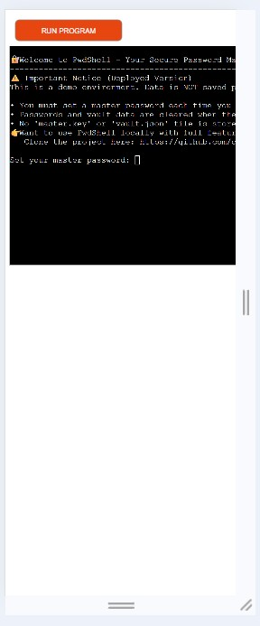 |  | 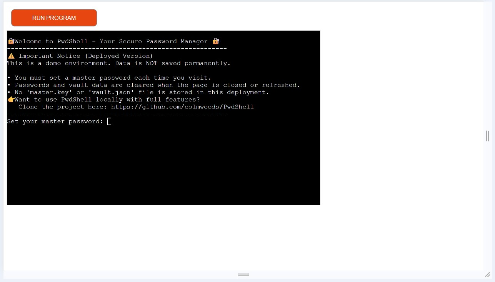 | Mobile: `overflow-x` occurs. iPhone does not accept input. Android accepts input but can stop randomly. |

---

## Browser Compatibility

I tested the deployed site on multiple browsers.  

| Chrome | Firefox | Safari | Edge | Opera | Brave | Notes |
| --- | --- | --- | --- | --- | --- | --- |
|  |  |  | 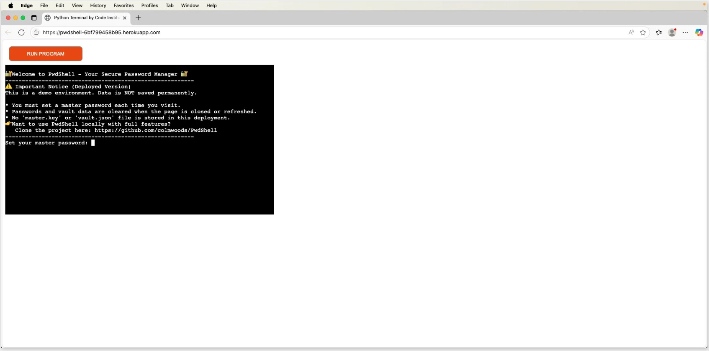 |  |  | Chrome: works fully. Firefox: emojis cut-off. Safari: terminal input unreliable. Edge: works as expected. Opera: works as expected. Brave: works fully |

---

## Lighthouse Audit

I ran Lighthouse audits on the deployed Heroku site.  
Scores are lower on mobile due to **third-party scripts** and **Code Institute terminal environment**, which are outside my control.  
Desktop performance and accessibility scored higher.  

| Mobile | Desktop |
| --- | --- |
| 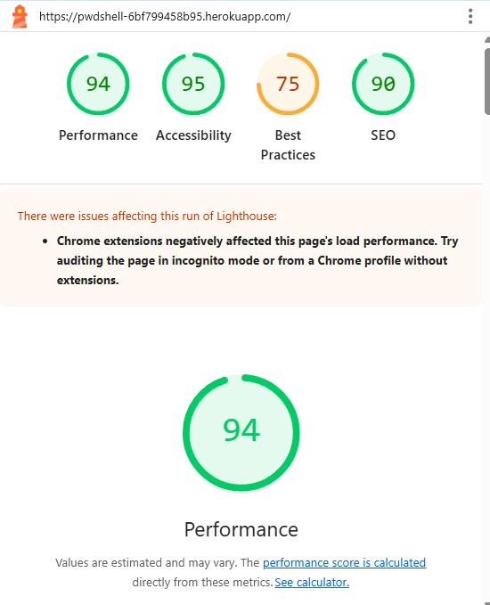 | 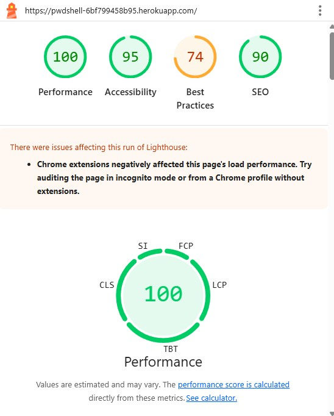 |

---

## Defensive Programming

Defensive programming was tested extensively, covering both **happy paths** and **bad inputs**.  

| Feature | Expectation | Test | Result | Screenshot |
| --- | --- | --- | --- | --- |
| Master Password Setup | Should not accept empty or mismatched passwords. | Pressed Enter with no input, and entered two different passwords. | Both rejected with clear error messages. | 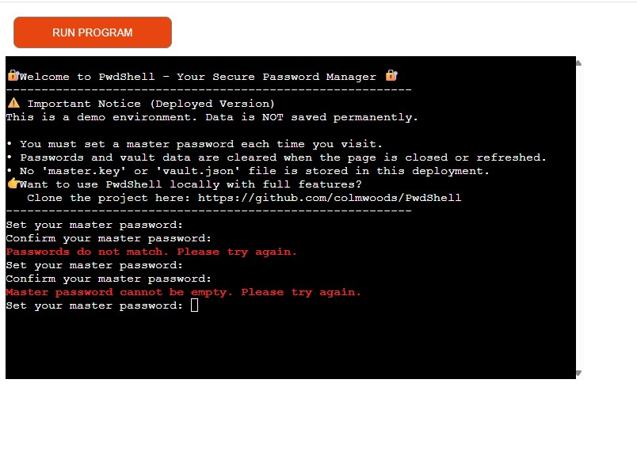 |
| Login Attempts | Only correct master password should unlock. | Tried wrong password 3 times, then correct one. | Wrong attempts rejected, correct one accepted. |  |
| Add Account | Should reject duplicates. | Added "google" twice. | First saved, second rejected. | 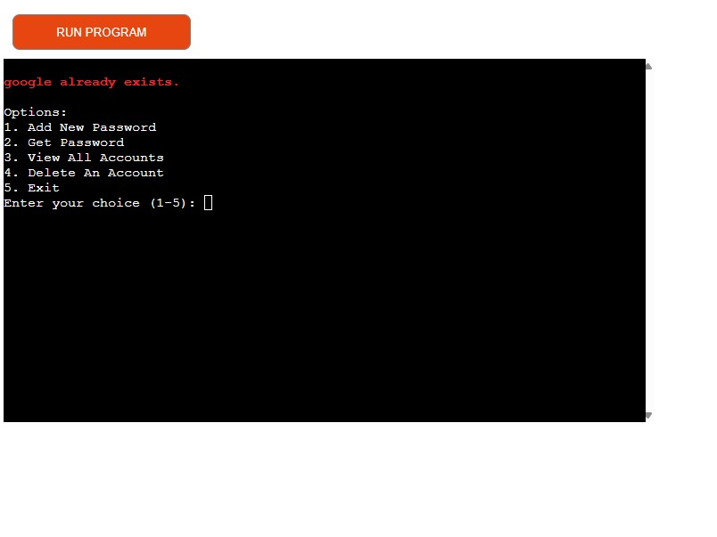 |
| Get Password | Should return correct credentials if they exist. | Retrieved "twitter" account. | Correct details displayed. |  |
| Delete Account | Should handle missing accounts. | Deleted "twitter" twice. | First deleted, second rejected. | 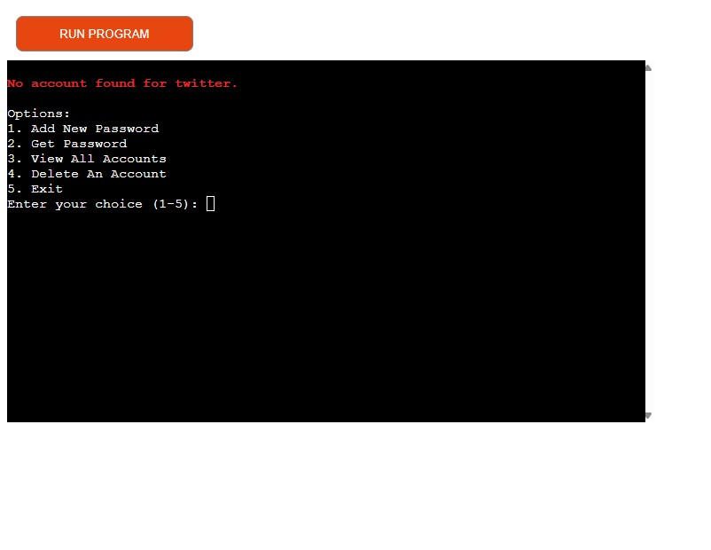 |
| Empty Input | Should not accept blank values. | Tried adding account with blank username. | Input rejected with error. | 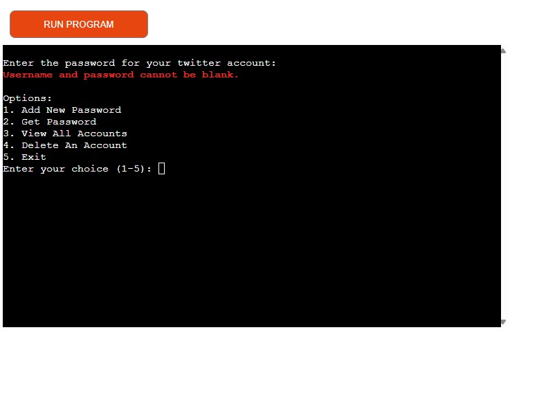 |
| Exit Handling | Program should close safely. | Used Exit menu and pressed CTRL+C. | Exit menu closed cleanly, CTRL+C showed handled error. |  |
| Efficient Prompts | Users should never be asked for data already stored. | Tried creating a master password twice; tried adding duplicate account. | App reused stored master key / rejected duplicate account with error message. |

---

### Error Reporting
Errors caused by user or data actions are always reported back to the user in a clear, colour-coded way:
- **Input validation**: Blank or mismatched passwords, invalid menu choices, and duplicate entries are rejected with red error messages.  
- **Data handling**: Corrupted or missing `vault.json` files trigger an error message and the app safely resets to an empty vault.  
- **Session handling**: On wrong master password attempts, the user is notified immediately and access is blocked.  
- **Exit handling**: CTRL+C interrupts display a friendly error message instead of a crash.  

This ensures the user is always informed of what went wrong and how the program has responded.

---

## User Story Testing

All user stories from the README were manually tested.  

| Target | Expectation | Outcome | Screenshot |
| --- | --- | --- | --- |
| As a user | I want to set and confirm a master password | so that my vault is secure. | 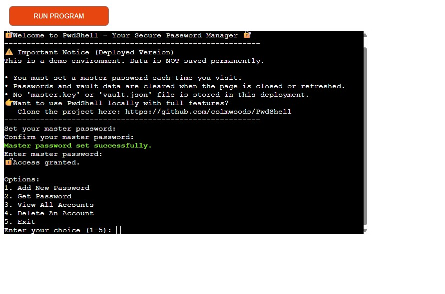 |
| As a user | I want to log in with my master password | so that only I can access my vault. |  |
| As a user | I want to add new accounts | so that I can securely save my credentials. |  |
| As a user | I want to view stored accounts | so that I can check which ones are saved. | 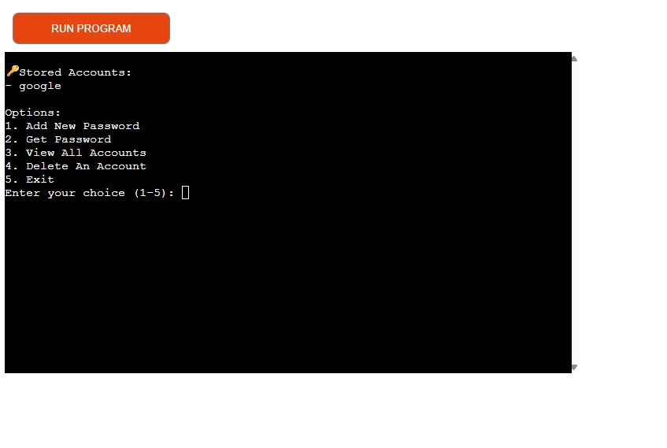 |
| As a user | I want to retrieve a password | so that I can log into accounts when needed. | 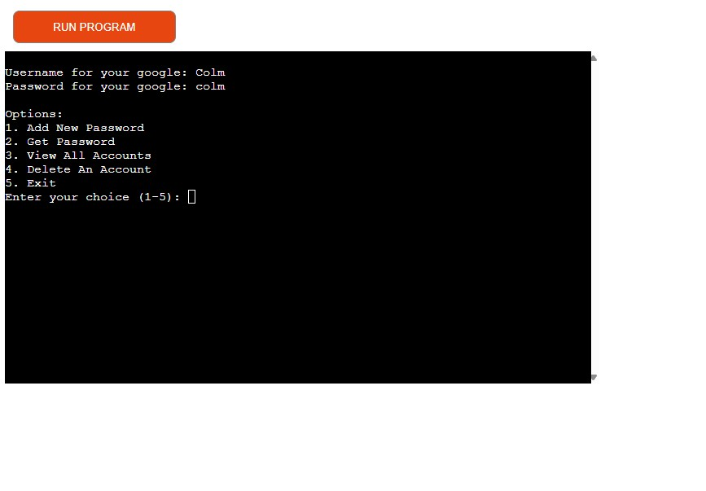 |
| As a user | I want to delete accounts | so that I can keep the vault clean. |  |
| As a user | I want to exit safely at any time | so that I don’t corrupt the vault. | 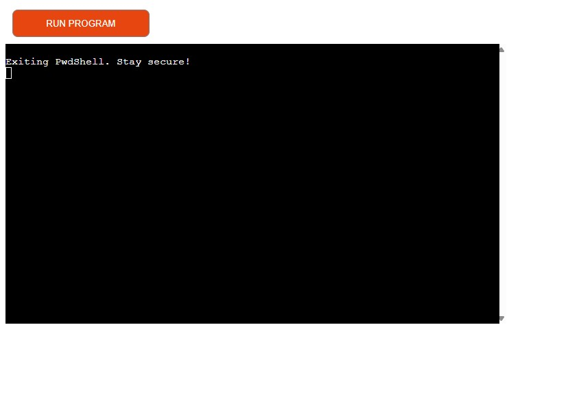 |

---

## Bugs

### Fixed Bugs

- Fixed `PEP8` violations (E302, E501, W293, indentation issues).  
- Fixed issue where mismatched passwords in setup caused crash → now loops until valid.  
- Fixed JSON decode error when vault.json was empty/corrupted → now defaults to empty dict.
- **Fixed Deployment Bug**: 
  - Heroku defaulted to Python 3.13, causing dependency build errors (`pillow`, `numpy`).  
  - Added `.python-version` file to pin Python to 3.12.  
  - Cleaned up `requirements.txt` to include only actual dependencies (`cryptography`, `colorama`).  
  - After these fixes, the build completed and the app deployed successfully.  
- **Fixed Input Validation Bug**:  
  - Previously, blank values for account name, username, or password were still accepted.  
  - Added if, else defensive checks to reject empty inputs inside the add_new_password function, ensuring all fields must be filled before saving.  

---

### Unfixed Bugs

Currently, no functional bugs remain open. Any remaining issues are environmental (see below).

---

### Known Issues

| Issue | Explanation | Screenshot |
| --- | --- | --- |
| Colors fainter on Heroku. | Due to Code Institute’s terminal emulator. | 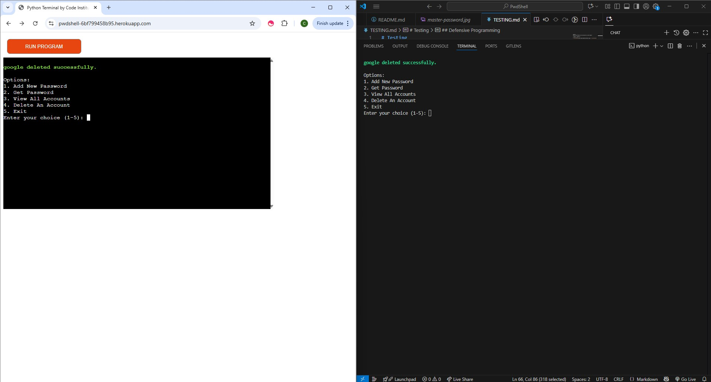 |
| Emojis cut off in Firefox. | Known rendering issue with terminal fonts. | 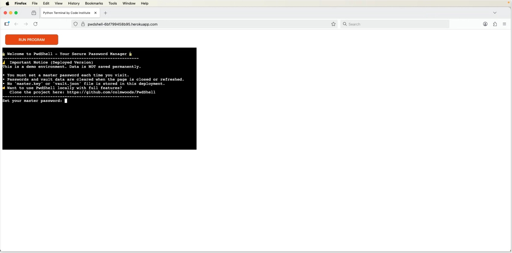 |
| Input broken in Safari/iOS. | Code Institute terminal not fully supported. |  |
| CTRL+C exits with error message. | Default Python behavior, partially handled with exception catch. | 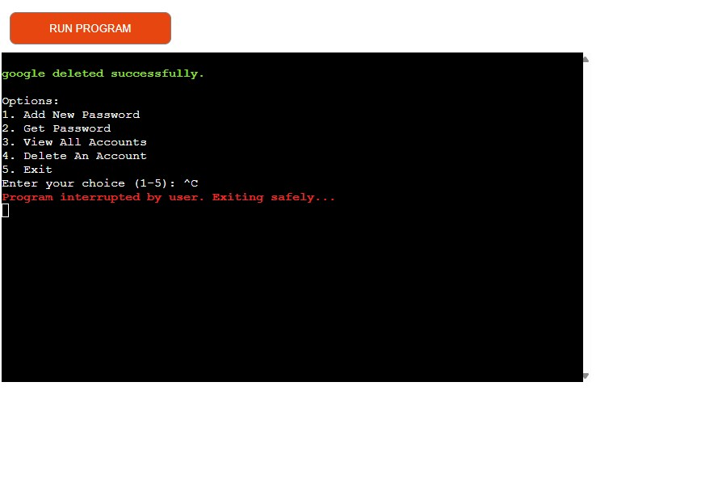 |

> [!NOTE]  
> Some design choices, such as storing passwords in plaintext JSON and not enforcing password strength rules, are deliberate.  
> They were made to ensure simplicity, transparency, and easy assessment by Code Institute, while still demonstrating hashing, file handling, and secure input with `getpass`.  
> These choices are appropriate for the target audience of this educational project and do not represent logic errors.

> [!IMPORTANT]  
> No remaining functional bugs are known. Environment-specific issues have been documented.  
